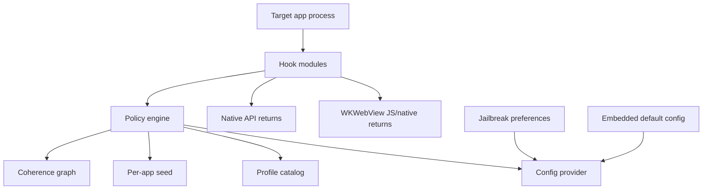

# Architecture

## System Overview

Loupehole should be built as a small injected runtime with a policy engine at the center. Hook modules should not make independent spoofing decisions. They ask the policy engine for values so every API family remains coherent.

## Runtime Components

### Core Library

Responsibilities:

- Load static/default profile.
- Derive app-scoped seeds.
- Answer normalized values.
- Own the coherence graph.
- Provide safe helper functions for hooks.
- Keep no telemetry.
- Prevent hook modules from embedding identifying constants or spoofed values directly.

Suggested modules:

- `LHPolicyEngine`
- `LHProfile`
- `LHAppContext`
- `LHSeed`
- `LHCoherenceGraph`
- `LHValueQuantizer`
- `LHCompatibility`

Implementation language:

- The injected runtime must use C, Objective-C, or Objective-C++.
- Swift is excluded from the injected dylib because its runtime metadata, reflection strings, mangled symbols, ABI/runtime dependencies, and binary size make release auditing and low-marker injection harder.
- Swift is acceptable for the optional preference UI or external tooling where it does not load into protected app processes.

### Hook Modules

Each imported hook module should map to one mitigation method. Higher-level grouping, such as "identity" or "storage", belongs in configuration, UI, or build presets rather than the injected module boundary. The compilation boundary is driven by a static mitigation catalog and build-selection JSON; no dynamic module loading is used in target processes. Early mitigation-level modules include:

- `IDFVMitigation`
- `BootTimeSysctlMitigation`
- `BootTimeProcessInfoMitigation`
- `VolumeCreationTimeMitigation`
- `DeviceModelSysctlMitigation`
- `ProcessInfoCPUMitigation`
- `StorageCapacityMitigation`
- `DisplayHooks`
- `BatteryHooks`
- `LocaleHooks`
- `AccessibilityHooks`
- `PasteboardHooks`
- `NetworkHooks`
- `FontsVoicesHooks`
- `AudioHooks`
- `MetalHooks`
- `TelephonyHooks`
- `URLSchemeHooks`
- `KeychainHooks`
- `StorageGuardHooks`
- `WebKitHooks`
- `PermissionedDataHooks`

Hook modules should be compiled as thin adapters around a shared internal ABI. The first dylib should already use the final boundaries: generated module registration, per-mitigation compile selection, policy-engine lookups, and centralized value generation. A placeholder or no-op implementation is preferable to a shortcut that embeds spoofed constants in hook code.

Mitigation IDs use `domain.surface.api_or_method.variant`, for example
`system.boot_time.sysctl.synthetic`. Every ID includes a variant segment, even
when only one variant exists. The generated registry derives install symbols
from IDs using `LHMitigation_` plus the ID with dots replaced by underscores,
then `_install`.

Hook backend:

- Use an `LHHookBackend` abstraction from the first implementation.
- The first backend should be Theos/Logos with MobileSubstrate-compatible hooks.
- ElleKit/libhooker-specific backends can be added later behind build flags without changing policy or mitigation code.

### Config Provider

Inputs, in priority order:

1. Emergency per-bundle bypass.
2. Jailbreak preference UI profile.
3. Embedded build-time config.
4. Built-in default profile.

No remote config. No analytics.

All spoofed values should flow through the config/profile layer. Hook modules should contain selectors and system API glue, not project-specific identifiers, unique salts, or hand-coded spoof return values.

### State Scope and Storage

Values should be generated for an explicit scope. The default scope is per app, because it reduces cross-app linking. Compatibility profiles may allow the user to share mitigations across related apps when a suite expects sibling apps to agree.

Supported scope modes:

- Per app: one state record per bundle ID. This is the default.
- Per vendor group: one state record shared by apps that are intentionally grouped by vendor policy.
- Per shared app group: one state record shared by apps that have a real shared entitlement or jailbreak package state.
- Manual linked group: an explicit user-created group of bundle IDs.

Each Loupehole configuration instance should have one high-entropy instance seed represented as a UUID, without restricting the UUID version. The user can preserve, export, or reuse this seed to recreate the same generated state layout and value derivations across a new dylib or package build. The seed is not an app-visible API value. It is input material for deterministic derivation of scoped seeds, state record identifiers, shared-storage keys, generated internal names, and optional build variability.

When a scope is shared, the whole mitigation tuple should be shared. IDFV replacement, synthetic boot time, volume initialization or creation time, synthetic install epoch, WebView profile, and related app-scoped seeds should come from the same scoped state. Mixing scopes is allowed only when documented as a compatibility decision.

State identifiers must not reveal the project. Filenames, App Group record names, Keychain service names, Keychain account names, preference keys visible to target processes, and any other storage keys must be derived from the instance seed and scope identifier with a keyed hash or KDF. The default KDF is HKDF-SHA256 implemented with C/Objective-C-compatible Apple crypto APIs. Purpose labels are derivation inputs only and must not be stored next to derived names. Derived names must not contain `Loupehole`, module names, obvious prefixes, bundle filters, or readable mitigation labels. If a user rebuilds with the same instance seed and scope inputs, the derived paths and keys should match; if they rotate the instance seed, every derived storage name should rotate.

The state layer should be hidden behind a provider interface so mitigation code does not care where state is stored:

- `LHEmbeddedStateProvider`: deterministic, read-only defaults for early dylib tests and custom builds.
- `LHLocalStateProvider`: per-app sandbox state for sideloaded testing when no shared entitlement exists.
- `LHPackageStateProvider`: package-owned state under rootless jailbreak storage for `.deb` installs.
- `LHAppGroupStateProvider`: shared container state for sideloaded apps signed with a common App Group entitlement.
- `LHKeychainGroupStateProvider`: compact shared state for sideloaded apps signed with a common Keychain Access Group entitlement.

Mutable state records should use binary property list encoding with explicit schema versioning. JSON is acceptable for debug export/import tools, but not for target-process runtime state.

Jailbreak packages should use package-owned rootless storage while keeping target app containers untouched unless the user explicitly requests cleanup. Public package metadata may use the project name, but target-process-visible storage names must be seed-derived and non-descriptive.

Sideloaded apps without jailbreak cannot reliably synchronize writable state across separately sandboxed apps unless they share entitlements. If the apps are signed with a common App Group entitlement, use the app-group container. If they are signed with a common Keychain Access Group entitlement, use shared Keychain items for compact state. If neither entitlement exists, use local per-app state or deterministic embedded config and do not claim true cross-app synchronization.

### Storage Guard Hardening

Opaque, seed-derived storage names are the primary defense. Hooking storage APIs to hide Loupehole-owned records is a later hardening feature for storage backends that are target-visible by design, not the first line of defense.

`StorageGuardHooks` should protect only Loupehole-owned state records derived from the current instance seed. It must not hide, modify, or delete unrelated app records.

Keychain guard behavior:

- Filter Loupehole-owned records out of broad `SecItemCopyMatching` results, including `kSecMatchLimitAll` and attribute-only queries.
- Ignore, reject, or protect against target-app `SecItemUpdate` and `SecItemDelete` calls that accidentally match Loupehole-owned records.
- Allow Loupehole's own state provider to read, write, update, and delete through an explicit reentrancy bypass.
- Leave the app's storage call unfiltered in compatibility mode when ownership is uncertain.

Shared App Group or file-backed guard behavior is optional and stricter because the API surface is broader. It may require filtering `FileManager`, `open`, `stat`, `getattrlist`, `readdir`, `unlink`, and URL resource-value paths. Prefer opaque filenames and avoid shared containers unless shared scope is explicitly needed.

This module is separate from `KeychainHooks`. `KeychainHooks` mitigates app reinstall tracking and app-generated persistent identifiers. `StorageGuardHooks` protects Loupehole's own state from discovery or accidental deletion when that state must live in a target-visible backend.

### Coherence Graph

The graph maps a profile to a plausible Apple device family:

- Marketing device family.
- `hw.machine`, `hw.model`, `uname.machine`.
- CPU count and RAM.
- GPU name and Metal feature families.
- Screen native bounds, scale, native scale, refresh rate, display gamut, safe area.
- Camera count/types/unique ID shapes.
- WebKit navigator/screen/WebGL values.
- OS version and kernel build family.
- Temporal relationships between system values, including boot time, volume initialization or creation time, app install time, profile rotation time, and slowly varying values.

Profiles should be versioned. A profile update must not silently change an app's stable identifiers unless the user rotates that app profile.

Temporal coherence is mandatory. If the tweak reports a synthetic boot time and a synthetic volume initialization or creation time, the volume time must be earlier than the last boot time. The same rule applies generally: generated dates, counters, and slowly varying values must form a plausible timeline rather than independent random-looking facts.

## Configuration Profiles

### Compatibility

Goal:

- Reduce the worst passive fingerprinting while preserving app behavior.

Behavior:

- Normalize IDFV-like identifiers per app.
- Coarsen storage, battery, boot time, locale, and WebView details.
- Leave camera, location, contacts, photos, calendars, reminders, music mostly pass-through after user permission.
- Do not block URL schemes that are likely required by app features.

### Standard

Goal:

- Default privacy improvement for most apps.

Behavior:

- Full passive normalization.
- WebView anti-fingerprinting enabled.
- URL scheme probing returns a common cohort set unless the app opens a user-initiated URL.
- Keychain reinstall tracking guarded.
- Permissioned APIs summarized or coarsened when possible.

### Strict

Goal:

- Maximum privacy for high-risk apps where breakage is acceptable.

Behavior:

- Empty or generic responses for app inventory, local network, Bluetooth, contacts summaries, music taste, photo metadata, reminder titles, calendar source names.
- Coarse location.
- Camera enumeration reduced to a common virtual set if the app does not need capture.
- WebView canvas/WebGL/audio/timing heavily normalized.

## Build Variability

Build variability is useful for reducing static signature matching, but it should not create unique runtime behavior.

Allowed variability:

- Symbol prefixes.
- Internal class names.
- Section names.
- Non-observable module ordering.
- Optional inclusion of modules.
- Build ID omitted or cohort-shared.
- Dead-code layout changes.

Risky variability:

- Unique API return values.
- Unique JS patches.
- Unique timing behavior.
- Unique error messages.
- Unique config file paths.
- Unique log strings.

Hard ban:

- Project-identifying strings inside the injected runtime.
- Static unique salts.
- Project-specific Keychain services or preference keys visible in target app processes.
- Project-specific JavaScript globals or function names visible to page scripts.
- Hardcoded fake values in hook code when those values should be profile data.

Release audit:

- Run string extraction on the final dylib.
- Verify exported symbols are stripped or generated.
- Verify no debug logs are present.
- Verify no build timestamp, UUID, or unique build ID is app-visible.
- Verify WebView injected scripts do not expose project names or rare globals.
- Verify default spoofed values are loaded from shared profile definitions.

Build variability must be controlled by build flags. Development builds can keep readable internal names for debugging. Release and custom builds should enable generated internal names, stricter symbol stripping, and release audits.

## Local Development Workflow

The first working artifact should be a plain arm64 iOS `.dylib` built from the same source tree that will later be packaged by Theos. This lets the runtime, hook backend, and policy engine stabilize before package scripts and preferences add more moving pieces.

Recommended workflow:

1. Build `core/` as the policy/profile library.
2. Build `packages/tweak/` as a minimal injectable dylib with module registration, a safe constructor, and no-op hooks.
3. Add the first passive mitigation group end to end: IDFV replacement, boot time normalization, and volume initialization or creation time normalization, with option documentation and audit scripts.
4. Package the same dylib in a rootless `.deb`.
5. Add preferences/config loading only after the embedded default config path is working.
6. Expand module coverage while keeping all values profile-driven.

Real-device deployment is intentionally manual for now. The repository should build artifacts for either Sideloadly-style owned-app injection flows or rootless jailbreak package installation, but device install, injection, and behavioral verification are performed outside the automated build loop.

## Option Catalog

Website custom builds should default to shared templates. Advanced custom values should display a uniqueness warning.

Every hook module must map to an option catalog entry. Every option catalog entry must include:

- Affected APIs.
- Original API behavior.
- Fingerprinting mechanism.
- Mitigation behavior.
- Common defaults.
- Drawbacks.
- Coherence dependencies.
- Test plan.

The full required template is defined in [spoofing-option-policy.md](spoofing-option-policy.md).

## Jailbreak Package Design

Use Theos for the first package.

Artifacts:

- Rootless `.deb` as primary.
- Optional rootful package if needed.
- Filter plist for selected bundle IDs.
- Preference bundle.

Theos notes:

- Theos supports multiple platforms and common package formats.
- Rootless packages install under `/var/jb`.
- Rootless iOS commonly uses `iphoneos-arm64`.
- Filter plists control process injection by bundle, executable, or class.

Recommended first filter:

- Do not inject into every process by default.
- Start with a user-selected app allowlist.
- Exclude SpringBoard, system daemons, banking/DRM apps, and critical Apple services unless explicitly tested.

Install and uninstall requirements:

- The package must support clean install, upgrade, disable, and uninstall flows.
- The initial install must not inject into any app until an allowlist or explicit build-time filter is present.
- Maintainer scripts may create package-owned directories, migrate package-owned configuration, refresh loader caches where required, and remove package-owned artifacts on uninstall.
- Uninstall must remove the dylib, filter plist, preference bundle, package-owned caches, launch helpers, generated module manifests, and package-owned default configuration.
- Uninstall must not delete protected app containers, app Keychain items, or user-selected cleanup targets unless the user explicitly requested that privacy cleanup in preferences or through a separate helper command.
- A reinstall should be able to start cleanly after uninstall without stale filter plists, stale generated names, or dangling package-owned preference files.

## Website Builder Design

### User Flow

1. Choose target: jailbreak package or developer dylib.
2. Choose profile: compatibility, standard, strict.
3. Choose modules.
4. Choose app bundle filters.
5. Review uniqueness score.
6. Build artifact.
7. Download artifact and manifest.

### Backend

Use macOS workers for official artifacts.

Components:

- Build API.
- Queue.
- macOS worker pool.
- Theos/Xcode toolchain image.
- Artifact store with short retention.
- Manifest generator.

Security:

- No arbitrary user scripts.
- No user-provided source code in v1.
- Predefined mitigation module toggles only.
- Hard resource/time limits.
- Artifacts expire.
- No telemetry beyond operational build status.

## Test Harness

The harness should answer four questions:

1. Did the hook apply?
2. Did the app remain stable?
3. Did the exposed values become less identifying?
4. Are there contradictions?

Test apps:

- Native Loupe-style probe app.
- WKWebView fingerprint page.
- App compatibility suite with camera, audio, maps, login, WebView, and media playback flows.

Reports:

- Raw observed value.
- Protected observed value.
- Expected cohort value.
- Entropy bucket.
- Coherence result.
- Breakage notes.

## Failure Modes

Never disable all hooks as the normal response to a single mitigation failure. Each mitigation should define its own best-effort generic fallback and rollback behavior. If a coherent generic fallback is not available, the affected mitigation may pass through the real value in compatibility mode. Strict mode may return documented generic or denied values only when they remain coherent with the active profile.

Examples:

- If a display hook cannot find a coherent profile value, use the display module's documented generic fallback or return the real display value in compatibility mode.
- If a WebView script injection fails, log only in diagnostics mode.
- If config is corrupt, load built-in defaults.
- If a hook detects an unsupported OS/API version, bypass that hook.

## Logging

Default:

- No logs.
- No files.
- No network.

Diagnostics mode:

- Per-app opt-in.
- Ring buffer in memory.
- Manual export from preferences.
- Redact identifiers.
