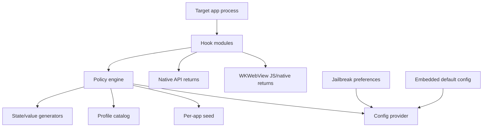

# Architecture

## System Overview

Loupehole should be built as a small injected runtime with a policy engine at the center. Hook modules should not make independent spoofing decisions. They ask the policy engine for values generated from shared seeds and state.



## Runtime Components

### Core Library

Responsibilities:

- Load the static/default build profile.
- Derive app-scoped seeds.
- Answer normalized values.
- Provide safe helper functions for hooks.
- Keep no telemetry.
- Prevent hook modules from embedding identifying constants or spoofed values directly.

Implementation language:

- The injected runtime must use C, Objective-C, or Objective-C++.
- Swift is excluded from the injected dylib because its runtime metadata, reflection strings, mangled symbols, ABI/runtime dependencies, and binary size make release auditing and low-marker injection harder.
- Swift is acceptable for the optional preference UI or external tooling where it does not load into protected app processes.

### Hook Modules

Each imported hook module should map either to one mitigation method or to a
surface-level composite when reliable coverage requires several API methods for
the same policy value. Higher-level grouping, such as "identity" or "storage",
belongs in configuration, UI, or build presets rather than the injected module
boundary. The compilation boundary is driven by a static mitigation catalog and
build-selection JSON; no dynamic module loading is used in target processes.

As an example, `BootTimeMitigation` is the default catch-all mitigation for the boot-time
surface. It imports the sysctl-family component and the `NSProcessInfo`
component so a build can select one boot-time mitigation while still covering
several call paths. `BootTimeSysctlMitigation` hooks both public sysctl wrappers
and the available underscored syscall entry names for `kern.boottime`. It
requests both function patching and imported-symbol rebinding from the backend,
because Swift and libSystem call sites may not all pass through a patchable
wrapper in the same way. These modules do not contain profile defaults or
temporal policy logic.

Mitigation source files are organized by runtime domain and surface:

```text
packages/tweak/sources/<domain>/<surface>/<Component>Mitigation.{c,m,mm}
```

Mitigation IDs use `domain.surface.api_or_method.variant`, for example
`system.boot_time.composite.synthetic`. Every ID includes a variant segment,
even when only one variant exists. The generated registry derives install
symbols from IDs using `LHMitigation_` plus the ID with dots replaced by
underscores, then `_install`.

Policy value IDs come from `config/policy-values.json` and are independent from
mitigation IDs. Multiple mitigation modules can request the same policy value,
which keeps alternate hook implementations coherent.

Hook backend:

- Use an `LHHookBackend` abstraction from the first implementation.
- The backend is Theos/Logos with MobileSubstrate-compatible hooks.
- C APIs can require two hook strategies: patching the shared implementation and
  rebinding imported symbol pointers in already-loaded images. Both operations
  live behind `LHHookBackend` so mitigation modules stay policy adapters instead
  of Mach-O parsers.

### Config Provider

Inputs, in priority order:

1. Emergency per-bundle bypass.
2. Package policy override/default.
3. Embedded build-time config.
4. Built-in default policy.

No remote config. No analytics.

All spoofed values should flow through the config/profile layer. Hook modules should contain selectors and system API glue, not project-specific identifiers, unique salts, or hand-coded spoof return values.

For the rootless package, keep injection and runtime behavior separate.
The Substrate/loader filter decides which bundles load the dylib; runtime
behavior comes from a package-owned policy file under a generated preferences
directory. The loader directory remains the standard
`MobileSubstrate/DynamicLibraries` location, but the installed dylib and filter
plist share a generated seed-derived basename. The policy path and loader
basename are derived from the build seed so the runtime and Settings bundle can
find them before loading the package root install seed. The root install seed
remains the practical seed for scoped runtime values and state. The package
policy contains a default behavior plus per-bundle overrides for enabled/off
state, scope mode, and the compiled mitigation module IDs to install.

The package installs with an empty filter and a default-off policy. When the
default policy is enabled, the Settings store uses the UIKit app-class filter
(`com.apple.UIKit`) rather than enumerating installed bundles. Package runtime
startup then rejects system bundle IDs, non-app processes, and extensions before
seed or hook setup. Explicit per-bundle policy rows still override the default,
including disabled rows that make one app no-op while the default policy stays
on.

The package's list of available mitigations is generated from the same build
selection that compiles the dylib. The Settings bundle does not discover modules
dynamically; the build generator emits the selected module ID/name map into
preference metadata, and the runtime only gates the compiled registry by numeric
module ID.

### State Scope and Storage

Values should be generated for an explicit scope. The default scope is per app
install, because it rotates when the protected app is removed and reinstalled
while still remaining stable during normal launches. Compatibility policies may
allow the user to share mitigations across related apps when a suite expects
sibling apps to agree.

Supported scope modes:

- Per app install: one namespace per app container install. The runtime stores a
  random opaque marker in app data at a path derived from the practical seed and
  bundle scope; deleting the app container deletes the marker and rotates the
  active seed.
- Per app: one stable namespace per bundle ID.
- Per vendor group: one namespace shared by apps that report the same original
  pre-spoof `identifierForVendor`, or by explicit vendor policy when configured.
- Custom seed/manual linked group: an explicit user-provided UUID used as the
  active seed. The Settings UI exposes this today as Custom seed. Manual linked
  behavior is represented by reusing that custom seed, without storing separate
  group entities or another runtime scope.

If a scope resolver cannot provide a usable identifier, such as a missing,
empty, or oversized bundle/vendor string, the scope layer must use a fresh
random alphanumeric fallback identifier. This fallback is intentionally
ephemeral and non-descriptive; it should not use readable constants such as
`app`, `vendor`, or project names.

Each Loupehole configuration instance should have one high-entropy instance seed
represented as a UUID when supplied by config, without restricting the UUID
version. If no config/build seed is supplied, the runtime creates a random
instance seed when `LHRuntimeConfigDefault` is built during runtime
initialization. The user can preserve, export, or reuse an explicit seed to
recreate the same generated state layout and value derivations across a new
dylib or package build. The seed is not an app-visible API value. It is input
material for deterministic derivation of scoped seeds, state identifiers,
storage keys, generated internal names, timeline values, and optional
build variability.

The random fallback seed is ephemeral. It is useful for profile-less local
experiments, but an explicit seed is required when values must reproduce across
app relaunches, state migration, or rebuilt artifacts.

Profile definitions should not carry unique concrete timestamps such as a fixed
boot age, fixed volume age, or fixed scope/seed epoch. Concrete mutable values are
derived by the owning policy resolver or mitigation source from the active
instance seed, a generated opaque derivation label, and the active scope, then
stored as a schema-versioned state blob when a writable provider is available.
Profiles may define shared cohort metadata, schema versions, and broad
plausibility constraints.

When a scope is shared, the whole mitigation tuple should be shared. IDFV replacement, synthetic boot time, volume initialization or creation time, synthetic install epoch, WebView profile, and related app-scoped seeds should come from the same scoped state. Mixing scopes is allowed only when documented as a compatibility decision.

State identifiers must not reveal the project. Filenames, Keychain service names, Keychain account names, preference keys visible to target processes, and any other storage keys must be derived from the instance seed and scope identifier with a keyed hash or KDF. The default KDF is HKDF-SHA256 implemented with C/Objective-C-compatible Apple crypto APIs. Derivation label IDs are declared beside the owning resolver or state-domain code with `LH_DERIVATION_LABEL(domain, name)`, and the generator emits opaque byte labels from the label ID plus configured instance seed for runtime use; readable IDs must not be stored next to derived names. Derived names must not contain `Loupehole`, module names, obvious prefixes, bundle filters, or readable mitigation labels. If a user rebuilds with the same instance seed and scope inputs, the derived paths and keys should match; if they rotate the instance seed, every derived storage name should rotate.

The state layer should be hidden behind a provider interface so mitigation code does not care where state is stored. Core state providers store and load opaque schema-versioned byte blobs keyed by seed-derived names; they do not know about IDFV, boot time, volume time, categories, or mitigation-specific parameters:

- `LHEmbeddedStateProvider`: deterministic, read-only defaults for early dylib tests and custom builds.
- `LHLocalStateProvider`: per-app sandbox state for sideloaded testing when no shared entitlement exists.
- `LHPackageStateProvider`: package-owned state under rootless jailbreak storage for `.deb` installs.

Mutable state blobs should use binary property list encoding with explicit schema versioning. JSON is acceptable for debug export/import tools, but not for target-process runtime state. The first local provider uses short binary-plist keys, which are generic and non-identifying, but they are still static strings. A later hardening pass should replace those static field keys with generated/keyed field names or a compact binary record format if audits show the keys are useful as static markers.

Jailbreak packages should use package-owned rootless storage while keeping target app containers untouched unless the user explicitly requests cleanup. Public package metadata may use the project name, but target-process-visible storage names must be seed-derived and non-descriptive.

Sideloaded apps without jailbreak should use local per-app state or deterministic
embedded config. Cross-app coordination is represented by explicit custom seeds;
the runtime should not claim true writable-state synchronization across separate
sandboxes.

### Seed Material Providers

Runtime seed material is resolved through `LHSeedProvider` before profiles and
mitigation values are queried. The provider first chooses a practical seed:

- Dylib/local mode practical seed: the generated build-selection seed.
- Deb/package mode practical seed: the package root install seed created by
  `postinst` under a generated opaque package-owned path.

The active runtime seed is then derived from the practical seed plus the resolved
scope:

- Per app install derives from the practical seed, bundle scope, and a raw
  random app-container marker. The marker path is opaque and seed-derived; the
  marker content is generated with system randomness and intentionally lives in
  app data so app reinstall rotates the seed.
- Per app and vendor group derive from the practical seed plus scope mode and
  scope identifier.
- Custom seed/manual linked group uses the configured UUID as the active seed
  directly. In package builds this deliberately overrides the package root seed
  for the selected default policy or bundle override.
- Hook and resolver code ask policy/state APIs for values and never inspect
  where seed material came from.

Package install scripts create package-owned directories and the package root
seed only. They do not eagerly generate app-specific seeds, because install time
does not know every authoritative scope. Per-app-install marker creation stays
tied to the same scope resolver used at runtime. Future preference UI or package
helpers can rotate/reset app markers, scoped state, or the root install seed
explicitly. The built-in Settings debug panel can rotate the root install seed
after a destructive confirmation; existing state is not migrated or deleted.

### Storage Guard Hardening

Opaque, seed-derived storage names are the primary defense. Hooking storage APIs to hide Loupehole-owned blobs is a later hardening feature for storage backends that are target-visible by design, not the first line of defense.

`StorageGuardHooks` should protect only Loupehole-owned state blobs derived from the current instance seed. It must not hide, modify, or delete unrelated app records.

Keychain guard behavior:

- Filter Loupehole-owned records out of broad `SecItemCopyMatching` results, including `kSecMatchLimitAll` and attribute-only queries.
- Ignore, reject, or protect against target-app `SecItemUpdate` and `SecItemDelete` calls that accidentally match Loupehole-owned records.
- Allow Loupehole's own state provider to read, write, update, and delete through an explicit reentrancy bypass.
- Leave the app's storage call unfiltered when ownership is uncertain.

Target-visible filesystem guard behavior is optional and stricter because the API surface is broader. It may require filtering `FileManager`, `open`, `stat`, `getattrlist`, `readdir`, `unlink`, and URL resource-value paths. Prefer opaque filenames and avoid target-visible storage unless an implemented provider requires it.

This module is separate from `KeychainHooks`. `KeychainHooks` mitigates app reinstall tracking and app-generated persistent identifiers. `StorageGuardHooks` protects Loupehole's own state from discovery or accidental deletion when that state must live in a target-visible backend.

### Generation Invariants

Relationships between values should be created by the generation functions that
own those values, not by a separate graph or policy-check system. When two
values must agree, their generators should share the same seed-derived anchor.
For boot and volume time, boot time derives anchor `A1`; volume time derives the
same `A1`, derives an additional offset, and subtracts the offset to produce
`A2`.

Profiles can still describe broad plausible Apple device families:

- Marketing device family.
- `hw.machine`, `hw.model`, `uname.machine`.
- CPU count and RAM.
- GPU name and Metal feature families.
- Screen native bounds, scale, native scale, refresh rate, display gamut, safe area.
- Camera count/types/unique ID shapes.
- WebKit navigator/screen/WebGL values.
- OS version and kernel build family.
- Temporal relationships between system values, including boot time, volume initialization or creation time, app install time, scope/seed rotation time, and slowly varying values.

Compiled profiles should be versioned. A build-profile update must not silently
change an app's stable identifiers unless the user rotates that app's scope or
seed.

Temporal ordering is mandatory, but it should be true by construction. If the
tweak reports a synthetic boot time and a synthetic volume initialization or
creation time, the volume time generator must derive a value earlier than the
boot time anchor rather than relying on a later graph check.

## Build Profiles

These profiles are compile-time/catalog choices for default behavior and custom
builds. Runtime preferences choose targeting, scope, custom seeds, and compiled
mitigation state; they do not select arbitrary device-profile values.

## Build Variability

Build variability is useful for reducing static signature matching, but it should not create unique runtime behavior.

Allowed variability:

- Symbol prefixes.
- Internal class names.
- Section names.
- Non-observable module ordering.
- Optional inclusion of modules.
- Build ID omitted or cohort-shared.
- Dead-code layout changes.

Risky variability:

- Unique API return values.
- Unique JS patches.
- Unique timing behavior.
- Unique error messages.
- Unique config file paths.
- Unique log strings.

Hard ban:

- Project-identifying strings inside the injected runtime.
- Static unique salts.
- Project-specific Keychain services or preference keys visible in target app processes.
- Project-specific JavaScript globals or function names visible to page scripts.
- Hardcoded fake values in hook code when those values should be profile data.

Release audit:

- Run string extraction on the final dylib.
- Verify exported symbols are stripped or generated.
- Verify no debug logs are present.
- Verify no build timestamp, UUID, or unique build ID is app-visible.
- Verify WebView injected scripts do not expose project names or rare globals.
- Verify default spoofed values are loaded from shared profile definitions.

Build variability must be controlled by build flags. Development builds can keep readable internal names for debugging. Release and custom builds should enable generated internal names, stricter symbol stripping, and release audits.

## Local Development Workflow

The current artifacts are a plain arm64 iOS `.dylib` and a rootless `.deb` built
from the same runtime source tree. This keeps the runtime, hook backend, policy
engine, package scripts, and preferences aligned.

Recommended workflow:

1. Build `core/` as the policy/profile library.
2. Build `packages/tweak/` as a minimal injectable dylib with module registration, a safe constructor, and no-op hooks.
3. Add the first passive mitigation group end to end: IDFV replacement, boot time normalization, and volume initialization or creation time normalization, with option documentation and audit scripts.
4. Package the same dylib in a rootless `.deb`.
5. Keep package policy and Settings configuration flowing through the config
   provider, not hook code.
6. Expand module coverage while keeping all values profile-driven.

Real-device deployment is intentionally manual for now. The repository should build artifacts for either Sideloadly-style owned-app injection flows or rootless jailbreak package installation, but device install, injection, and behavioral verification are performed outside the automated build loop.

## Option Catalog

Website custom builds should default to shared templates. Advanced custom values should display a uniqueness warning.

Every hook module must map to an option catalog entry. Every option catalog entry must include:

- Affected APIs.
- Original API behavior.
- Fingerprinting mechanism.
- Mitigation behavior.
- Common defaults.
- Drawbacks.
- Value dependencies.
- Test plan.

The full required template is defined in [spoofing-option-policy.md](spoofing-option-policy.md).

## Jailbreak Package Design

Artifacts:

- Rootless `.deb` as primary.
- Filter plist for selected bundle IDs.
- Preference bundle.

Install and uninstall requirements:

- The package must support clean install, upgrade, disable, and uninstall flows.
- The initial install must not inject into any app until the default policy or an
  explicit per-bundle policy enables injection.
- Maintainer scripts may create package-owned directories, migrate package-owned configuration, refresh loader caches where required, and remove package-owned artifacts on uninstall.
- Uninstall must remove the dylib, filter plist, preference bundle, package-owned caches, generated module manifests, and package-owned default configuration.
- Uninstall must not delete protected app containers, app Keychain items, or user-selected cleanup targets unless the user explicitly requested that privacy cleanup in preferences.
- A reinstall should be able to start cleanly after uninstall without stale filter plists, stale generated names, or dangling package-owned preference files.

## Profile Builder Design

### User Flow

1. Choose target: jailbreak package or developer dylib.
2. Choose build profile.
3. Choose modules.
4. Choose scope and app bundle filters.
5. Review uniqueness score.
6. Build artifact.
7. Download artifact and manifest.

## Failure Modes

Never disable all hooks as the normal response to a single mitigation failure. Each mitigation should define its own best-effort generic fallback and rollback behavior. If a coherent generic fallback is not available, the affected mitigation may pass through the real value.

Examples:

- If a display hook cannot find a coherent profile value, use the display module's documented generic fallback or return the real display value.
- If config is corrupt, load built-in defaults.
- If a hook detects an unsupported OS/API version, bypass that hook.

## Logging

Default:

- No logs.
- No files.
- No network.
