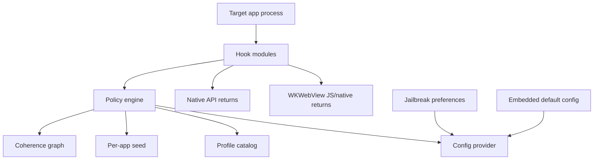

# Architecture

## System Overview

Loupehole should be built as a small injected runtime with a policy engine at the center. Hook modules should not make independent spoofing decisions. They ask the policy engine for values so every API family remains coherent.

## Runtime Components

### Core Library

Responsibilities:

- Load static/default profile.
- Derive app-scoped seeds.
- Answer normalized values.
- Own the coherence graph.
- Provide safe helper functions for hooks.
- Keep no telemetry.
- Prevent hook modules from embedding identifying constants or spoofed values directly.

Suggested modules:

- `LHPolicyEngine`
- `LHProfile`
- `LHAppContext`
- `LHSeed`
- `LHCoherenceGraph`
- `LHValueQuantizer`
- `LHCompatibility`

### Hook Modules

Each module should be independently switchable:

- `IdentityHooks`
- `SysctlHooks`
- `ProcessInfoHooks`
- `StorageHooks`
- `DisplayHooks`
- `BatteryHooks`
- `LocaleHooks`
- `AccessibilityHooks`
- `PasteboardHooks`
- `NetworkHooks`
- `FontsVoicesHooks`
- `AudioHooks`
- `MetalHooks`
- `TelephonyHooks`
- `URLSchemeHooks`
- `KeychainHooks`
- `WebKitHooks`
- `PermissionedDataHooks`

### Config Provider

Inputs, in priority order:

1. Emergency per-bundle bypass.
2. Jailbreak preference UI profile.
3. Embedded build-time config.
4. Built-in default profile.

No remote config. No analytics.

All spoofed values should flow through the config/profile layer. Hook modules should contain selectors and system API glue, not project-specific identifiers, unique salts, or hand-coded spoof return values.

### Coherence Graph

The graph maps a profile to a plausible Apple device family:

- Marketing device family.
- `hw.machine`, `hw.model`, `uname.machine`.
- CPU count and RAM.
- GPU name and Metal feature families.
- Screen native bounds, scale, native scale, refresh rate, display gamut, safe area.
- Camera count/types/unique ID shapes.
- WebKit navigator/screen/WebGL values.
- OS version and kernel build family.

Profiles should be versioned. A profile update must not silently change an app's stable identifiers unless the user rotates that app profile.

## Configuration Profiles

### Compatibility

Goal:

- Reduce the worst passive fingerprinting while preserving app behavior.

Behavior:

- Normalize IDFV-like identifiers per app.
- Coarsen storage, battery, boot time, locale, and WebView details.
- Leave camera, location, contacts, photos, calendars, reminders, music mostly pass-through after user permission.
- Do not block URL schemes that are likely required by app features.

### Standard

Goal:

- Default privacy improvement for most apps.

Behavior:

- Full passive normalization.
- WebView anti-fingerprinting enabled.
- URL scheme probing returns a common cohort set unless the app opens a user-initiated URL.
- Keychain reinstall tracking guarded.
- Permissioned APIs summarized or coarsened when possible.

### Strict

Goal:

- Maximum privacy for high-risk apps where breakage is acceptable.

Behavior:

- Empty or generic responses for app inventory, local network, Bluetooth, contacts summaries, music taste, photo metadata, reminder titles, calendar source names.
- Coarse location.
- Camera enumeration reduced to a common virtual set if the app does not need capture.
- WebView canvas/WebGL/audio/timing heavily normalized.

## Build Variability

Build variability is useful for reducing static signature matching, but it should not create unique runtime behavior.

Allowed variability:

- Symbol prefixes.
- Internal class names.
- Section names.
- Non-observable module ordering.
- Optional inclusion of modules.
- Build ID omitted or cohort-shared.
- Dead-code layout changes.

Risky variability:

- Unique API return values.
- Unique JS patches.
- Unique timing behavior.
- Unique error messages.
- Unique config file paths.
- Unique log strings.

Hard ban:

- Project-identifying strings inside the injected runtime.
- Static unique salts.
- Project-specific Keychain services or preference keys visible in target app processes.
- Project-specific JavaScript globals or function names visible to page scripts.
- Hardcoded fake values in hook code when those values should be profile data.

Release audit:

- Run string extraction on the final dylib.
- Verify exported symbols are stripped or generated.
- Verify no debug logs are present.
- Verify no build timestamp, UUID, or unique build ID is app-visible.
- Verify WebView injected scripts do not expose project names or rare globals.
- Verify default spoofed values are loaded from shared profile definitions.

## Option Catalog

Website custom builds should default to shared templates. Advanced custom values should display a uniqueness warning.

Every hook module must map to an option catalog entry. Every option catalog entry must include:

- Affected APIs.
- Original API behavior.
- Fingerprinting mechanism.
- Mitigation behavior.
- Common defaults.
- Drawbacks.
- Coherence dependencies.
- Test plan.

The full required template is defined in [spoofing-option-policy.md](spoofing-option-policy.md).

## Jailbreak Package Design

Use Theos for the first package.

Artifacts:

- Rootless `.deb` as primary.
- Optional rootful package if needed.
- Filter plist for selected bundle IDs.
- Preference bundle.

Theos notes:

- Theos supports multiple platforms and common package formats.
- Rootless packages install under `/var/jb`.
- Rootless iOS commonly uses `iphoneos-arm64`.
- Filter plists control process injection by bundle, executable, or class.

Recommended first filter:

- Do not inject into every process by default.
- Start with a user-selected app allowlist.
- Exclude SpringBoard, system daemons, banking/DRM apps, and critical Apple services unless explicitly tested.

## Website Builder Design

### User Flow

1. Choose target: jailbreak package or developer dylib.
2. Choose profile: compatibility, standard, strict.
3. Choose modules.
4. Choose app bundle filters.
5. Review uniqueness score.
6. Build artifact.
7. Download artifact and manifest.

### Backend

Use macOS workers for official artifacts.

Components:

- Build API.
- Queue.
- macOS worker pool.
- Theos/Xcode toolchain image.
- Artifact store with short retention.
- Manifest generator.

Security:

- No arbitrary user scripts.
- No user-provided source code in v1.
- Predefined module toggles only.
- Hard resource/time limits.
- Artifacts expire.
- No telemetry beyond operational build status.

## Test Harness

The harness should answer four questions:

1. Did the hook apply?
2. Did the app remain stable?
3. Did the exposed values become less identifying?
4. Are there contradictions?

Test apps:

- Native Loupe-style probe app.
- WKWebView fingerprint page.
- App compatibility suite with camera, audio, maps, login, WebView, and media playback flows.

Reports:

- Raw observed value.
- Protected observed value.
- Expected cohort value.
- Entropy bucket.
- Coherence result.
- Breakage notes.

## Failure Modes

Default behavior should be fail-open in compatibility mode and fail-closed only in strict mode.

Examples:

- If a display hook cannot find a coherent profile value, return the real display value rather than crashing.
- If a WebView script injection fails, log only in diagnostics mode.
- If config is corrupt, load built-in defaults.
- If a hook detects an unsupported OS/API version, bypass that hook.

## Logging

Default:

- No logs.
- No files.
- No network.

Diagnostics mode:

- Per-app opt-in.
- Ring buffer in memory.
- Manual export from preferences.
- Redact identifiers.
