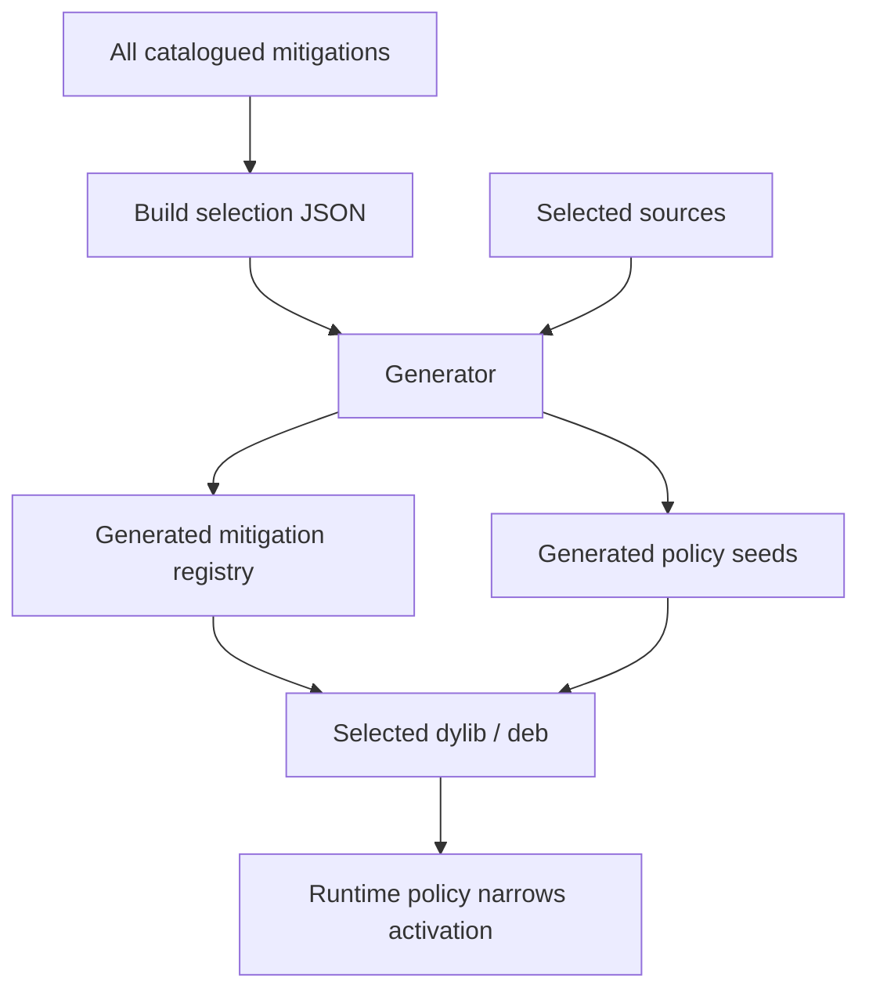

# Build Profiles

## Definition

A build profile is the declarative selection that determines which mitigation modules are compiled into an artifact. In the current repository, a selection is a JSON file such as `config/build.default.json`. It is distinct from runtime preference policy.

- **Build profile:** decides what code exists in the dylib or package.
- **Runtime policy:** decides which compiled modules are enabled for a process, bundle, or scope.
- **Policy seed declarations:** live in mitigation source and are compiled only when the owning source is selected.

There is no centralized value catalog, coherence profile, or cohort profile.

## Why Static Selection

Static selection keeps the build graph explicit, reduces dynamic-loader complexity, and lets verification examine exactly what was compiled. The generator validates selected IDs, dependencies, conflicts, source lists, link metadata, and policy seed declarations before Theos runs.



## Selection File Shape

The default selection currently records:

```json
{
  "schemaVersion": 1,
  "target": "ios-arm64-dylib",
  "configuration": "release",
  "minIos": "15.0",
  "buildSeed": "<UUID>",
  "mitigations": [
    "identity.idfv.uidevice.scoped_uuid",
    "system.boot_time.composite.synthetic",
    "storage.volume_creation_time.foundation.synthetic"
  ]
}
```

The build seed is generator input. In standalone dylib builds it is embedded as the runtime practical seed; the build path intentionally ignores `LH_EMBED_BUILD_SEED=0` outside package-runtime builds. In package builds the raw selection build seed is not embedded in the injected runtime dylib; it still drives generated names, compile-time policy seed bytes, and preference-bundle debug metadata.

## Variability

Build variability avoids every independently built artifact having identical nonfunctional structure or generated internal identities. The root Makefile exports `LH_ENABLE_VARIABILITY=1` by default. Variability must remain bounded:

- it must not change documented runtime semantics;
- it must not turn into user-unique observable behavior;
- it must not make debugging, auditing, or rollback impossible;
- it must not replace the seed/scope model;
- it must not become a project-identifying marker of its own.

## Profile Design Rules

A build profile should group mitigations that can be coherent together and validate together. A selection should not enable a surface merely because it compiles. Strong profiles have a stated compatibility goal, scope policy, required state domains, and validation evidence.

Coherence is documented and implemented by the mitigations that own the values. Do not add central profile machinery to force coherence globally.

## Reproducibility

The same catalog, selection, generator version, toolchain, and configuration should produce the same logical mitigation graph. Byte-for-byte equality can be affected by permitted build variability and toolchain factors, but the selected module set, generated IDs, policy seed bytes, and documented behavior should be reproducible and inspectable.
