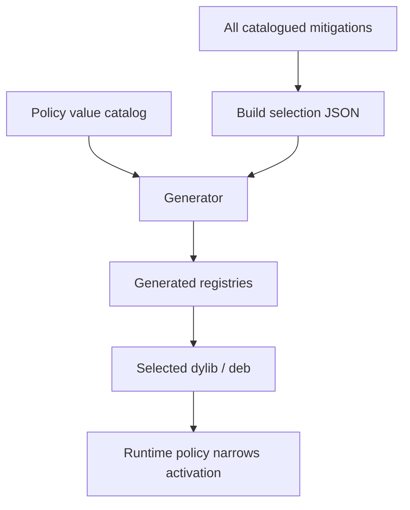

# Build profiles

## Definition

A **build profile** is the declarative selection that determines which mitigation modules and policy-value sources are compiled into an artifact. In the current repository, a selection is a JSON file such as `config/build.default.json`. It is distinct from runtime preference policy.

- **Build profile:** decides what code exists in the dylib or package.
- **Runtime policy:** decides which compiled modules are enabled for a process, bundle, or scope.
- **Cohort profile:** compiled policy data describing a shared, plausible value family. This is a separate concept from a build selection.

## Why static selection

Static selection is preferred for the initial system because it keeps the build graph explicit, reduces dynamic-loader complexity, and lets verification examine exactly what was compiled. The generator validates selected IDs, dependencies, conflicts, source lists, and link metadata before Theos runs.



## Selection file shape

The default selection currently records:

```json
{
  "schemaVersion": 1,
  "target": "ios-arm64-dylib",
  "configuration": "release",
  "minIos": "15.0",
  "instanceSeed": "<UUID>",
  "mitigations": [
    "identity.idfv.uidevice.scoped_uuid",
    "system.boot_time.composite.synthetic",
    "storage.volume_creation_time.foundation.synthetic"
  ]
}
```

The instance seed is an input to derivation, not a public build label. The exact default UUID should not be interpreted as a shared production identity.

## Variability

Build variability is a controlled way to avoid every independently built artifact having identical nonfunctional structure or generated internal identities. The root Makefile exports `LH_ENABLE_VARIABILITY=1` by default. Variability must remain bounded:

- it must not change documented runtime semantics;
- it must not turn into user-unique observable behavior;
- it must not make debugging, auditing, or rollback impossible;
- it must not replace the seed/scope policy model;
- it must not become a project-identifying marker of its own.

## Profile design rules

A build profile should group mitigations that can be coherent together and validate together. A selection should not enable a surface merely because it compiles. Strong profiles have a stated compatibility goal, scope policy, required state domains, and validation evidence.

Potential future profiles might differ by conservative versus strict surface coverage, but they must not invent broad claims such as “untraceable” or silently enable incompatible hardware/profile combinations.

## Reproducibility

The same catalogs, selection, generator version, toolchain, and configuration should produce the same logical mitigation graph. Byte-for-byte equality can be affected by permitted build variability and toolchain factors, but the selected module set, generated IDs, resolver mappings, and documented behavior should be reproducible and inspectable.
