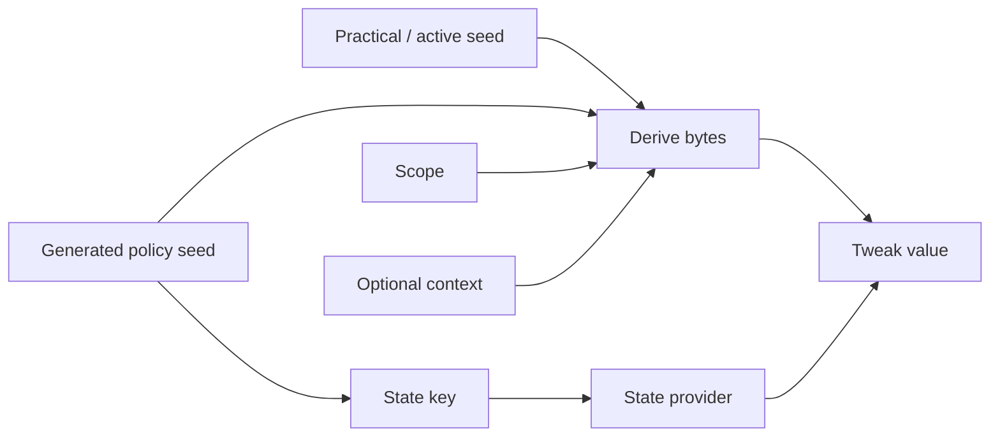

# Derivation And Opaque Names

## Definition

Derivation transforms seed material, generated labels or policy seeds, and scope into deterministic bytes. It creates separate namespaces for tweak values, state keys, storage names, package names, and other internal identities without copying literal identifiers into runtime logic.

## Domain Separation

There are two generated domain-separation inputs:

| Input | Declared by | Use |
| --- | --- | --- |
| `LH_DERIVATION_LABEL(domain, name)` | Runtime/internal source | Internal derivation labels for seed provider, state paths, and opaque names. |
| `LH_POLICY_SEED(domain, name, "literal")` | Tweak source | Tweak-owned value streams and state keys. |

The generator hashes the build seed plus each policy seed literal at compile time. The compiled artifact uses generated bytes, not the original literal.

## Output Forms

| Derived output | Use |
| --- | --- |
| Raw bytes | Seed material, state initialization, bounded number generation. |
| Contextual bytes | Derivation that includes extra state or marker context. |
| Opaque hexadecimal name | Storage directory/file identifiers that avoid fixed project markers. |
| Tweak value | UUID strings, timestamps, `timeval`, ASCII strings, or other API-specific shapes. |

## State Keys

A state key combines generated bytes and a schema version. The bytes identify the logical state domain; the schema version identifies its binary layout. A schema change must answer whether existing state is migrated, ignored, reset, or made backward-compatible.

## Why Files Need Derivation Too

Fixed directories, preference keys, Keychain names, and cache names can be project markers when visible to target applications or inspection tools. Deriving opaque names reduces obvious static identity while keeping storage stable for the required scope. It does not make state invisible and does not excuse unsafe file permissions or undocumented package behavior.

## Requirements

- Use generated labels or policy seeds, not hand-written runtime strings.
- Use distinct policy seeds for different semantic values, even within the same mitigation.
- Reuse a policy seed literal only for intentional cross-tweak agreement.
- Always combine policy seeds with the practical/active seed and scope.
- Do not use an opaque name as a user-facing identifier.
- Keep values and state roots within the proper package/local provider boundary.
- Document policy seed ownership and state lifetime in the mitigation page.
- Treat policy seed or label changes as compatibility changes because they rotate derived results.
