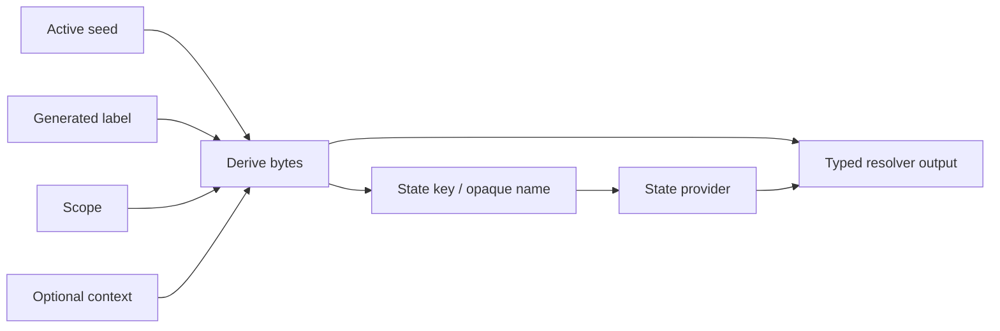

# Derivation and opaque names

## Definition

**Derivation** transforms a seed, a generated label, and a scope into deterministic bytes. It creates separate namespaces for policy values, state keys, storage names, package names, and other internal identities without copying literal identifiers into every module.

## Domain separation

A derivation label is a generated 16-byte identifier for one purpose. Labels prevent unrelated outputs from colliding merely because they share a seed and scope. The same label must not be repurposed for a different semantic value.

Examples of current label domains include:

- policy-value state and value material for IDFV;
- temporal-lifetime state, boot anchor, and volume-before-boot offset;
- seed-provider scoped active seed, app-install marker directory, marker record, and app-install active seed;
- generated package state/config paths and loader-related internal names.

## Output forms

| Derived output | Use |
| --- | --- |
| Raw bytes | Seed material, state initialization, bounded number generation. |
| Contextual bytes | Derivation that includes extra state or marker context. |
| Opaque hexadecimal name | Storage directory/file identifiers that avoid fixed project markers. |
| Typed policy value | Resolver-specific output such as a UUID string, `timeval`, or Foundation-compatible timestamp. |

## State keys

A state key combines a derivation label and a schema version. The label identifies the logical state domain; the schema version identifies its binary layout. A schema change must answer whether existing state is migrated, ignored, reset, or made backward-compatible.

## Why files need derivation too

Fixed directories, preference keys, Keychain names, and cache names can be project markers when visible to target applications or inspection tools. Deriving opaque names reduces obvious static identity while keeping storage stable for the required scope. It does not make state invisible and does not excuse unsafe file permissions or undocumented package behavior.

## Requirements

- Use generated labels, not hand-written runtime strings.
- Use distinct labels for different semantic values, even within the same mitigation.
- Do not use an opaque name as a user-facing identifier.
- Keep values and state roots within the proper package/local provider boundary.
- Document label ownership and state lifetime in the mitigation page.
- Treat label changes as compatibility changes because they rotate derived results.
