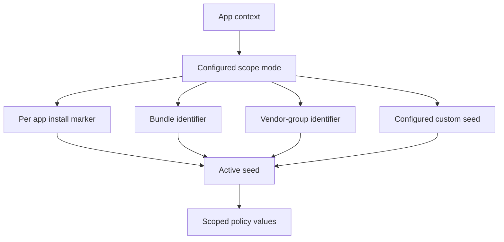

# Scopes

## Definition

A **scope** specifies the audience over which a derived or persisted value is shared. Scope is part of derivation input, not a label applied after a value is generated.

The current runtime defines four modes:

| Mode | Intended sharing boundary | Privacy / compatibility tradeoff |
| --- | --- | --- |
| Per app install | One app installation lifecycle. | Strongest routine unlinking; replacement changes when app-install marker changes. |
| Per app | One bundle identifier. | Stable for that app across the same configured seed; can preserve app-local expectations. |
| Per vendor group | Related vendor identifier when available. | Can preserve vendor-level sharing; requires careful input semantics and validation. |
| Manual linked group | Explicit user-configured group via custom seed. | Allows intentional linking; must never become an accidental default. |

## Why scope exists

Many native values are not simply “device values.” Their intended lifetime may be per vendor, per installation, per account, or per application. Returning one global synthetic value to every app can increase cross-app linkability. Returning a new value every call can break stateful behavior. Scope lets the policy match the sharing boundary deliberately.

## Implementation model

`LHScope` contains a scope mode and an identifier. `LHAppContext` resolves the appropriate scope from the active context and configuration before the active seed is resolved. The seed provider then derives or loads the active seed according to that mode.

For per-app-install mode, the provider persists an app-install marker at an opaque, derived path and derives the active seed from the practical seed, scope, and marker. For deterministic modes, it derives active seed material directly from practical seed and scope. Manual linked group uses an explicitly configured custom seed.

## Scope selection rules

- Use per-app-install for values where post-reinstall unlinkability is worth the compatibility tradeoff.
- Use per-app only when the value need not be shared by sibling apps.
- Use vendor-group only when its input and expected sharing behavior are well-defined for the API being normalized.
- Use manual linked groups only for deliberate, documented user control.
- Do not decide scope inside the hook; the policy engine must receive an already resolved scope.

## Scope and documentation

Every mitigation page must state its scope, what causes rotation, and whether sibling apps should observe the same value. “Scoped” is incomplete documentation without those details.
