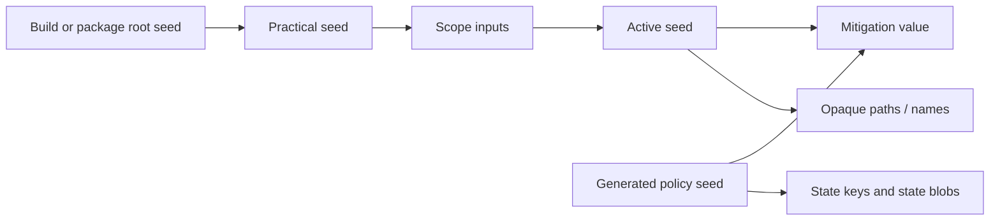

# Seeds

## Definition

A seed is a 16-byte secret input used to deterministically derive values, opaque storage identities, and state keys within a chosen scope. It is not itself a spoofed value and should not be exposed to target apps.

The seed model exists to make stability and rotation explicit. The same active seed, policy seed, and scope produce the same derived bytes; changing one input produces a separate result. Persisted state can preserve values that need a lifecycle beyond direct derivation.

## Seed Layers

| Layer | Meaning | Typical origin | Purpose |
| --- | --- | --- | --- |
| Build seed | UUID supplied by the build selection. | `config/build.default.json` or another selection file. | Generator input for generated names and compile-time policy seed bytes; standalone dylib practical seed; package preference debug metadata. |
| Package root seed | Persisted random seed in package mode. | Created once by `LHSeedProvider` when absent. | Stable package-level root without embedding the selection build seed in the deb-mode dylib. |
| Practical seed | Effective parent seed before scoping. | Custom manual-group seed, embedded build seed, or package root seed. | Unifies package and standalone modes. |
| Active seed | Seed used by mitigations after scope resolution. | Deterministic scoped derivation or app-install derivation. | Produces mitigation values and opaque names for the current context. |
| Policy seed | Compile-time generated domain separator declared by a mitigation. | `LH_POLICY_SEED(identifier)`. | Separates semantic value streams. |
| State-derived value | Persisted or generated value associated with active seed and scope. | `LHStateProviderLoadOrCreate`. | Preserves a value that needs stateful lifetime. |

## Build Seed Behavior

The runtime field is named `buildSeed` in both modes:

- In standalone dylib mode, it starts as the configured build seed. Standalone dylib builds always embed this seed so the runtime never falls back to a fresh random seed on every launch.
- In deb/package mode, the raw selection build seed is not embedded in the injected package dylib; after seed-provider resolution the same field holds the package-derived active seed.

This single name avoids a split build/instance vocabulary in the injected dylib. The important boundary is that package mode can carry the build seed in the deb's preference metadata, but not in the injected runtime dylib.

The package root seed is stored as 16 raw random bytes. The preferences debug pane displays those bytes in UUID-shaped lowercase text for readability; this formatting does not make the root seed an identity UUID.

## Why Seeds Rather Than Literal Values

Literal replacement values are difficult to rotate, easy to share accidentally, and can reveal a custom build. Seeds allow the project to derive outputs without storing every output in the binary. They also let a reset or scope change rotate a family of dependent values together.

A seed does not automatically make an output privacy-preserving. A mitigation still needs a plausible value shape, a suitable scope, and cross-surface coherence. With the default per-app-install scope, the standalone build seed is the practical seed but the final active seed also depends on the app-install marker. With deterministic scopes such as per-app or per-vendor, the build seed has more direct user-visible importance because it is the stable parent for that scope.

## Derivation Inputs

Mitigation derivation should use:

```text
active/practical seed + generated policy seed + scope mode + scope identifier [+ optional context]
```

The current implementation uses HMAC-SHA256/HKDF-style expansion in `LHSeed.c`. The generator emits policy seeds and internal labels into generated C data so policy-key strings are not scattered through runtime code.



## Rotation Events

A derived value may rotate when:

- the configured build seed changes;
- package root state is reset;
- a per-app-install marker changes because an app is reinstalled or reset;
- scope mode or scope identifier changes;
- a manual linked-group custom seed changes;
- a policy seed identifier changes;
- a state schema change deliberately invalidates old state.

The expected rotation behavior belongs in each mitigation's documentation. Rotation that is invisible in source but surprising to a user or app is a defect in the model.

## Seed Handling Constraints

- Seeds are configuration/state material, not telemetry.
- A UUID in `build.default.json` is a development selection input, not a production secret distribution mechanism.
- Hook modules do not parse, persist, or generate root seed material directly.
- Policy seeds are domain separators and must be combined with active/practical seed material.
- Persisted seed material and derived state are privacy-sensitive and need package lifecycle review.
