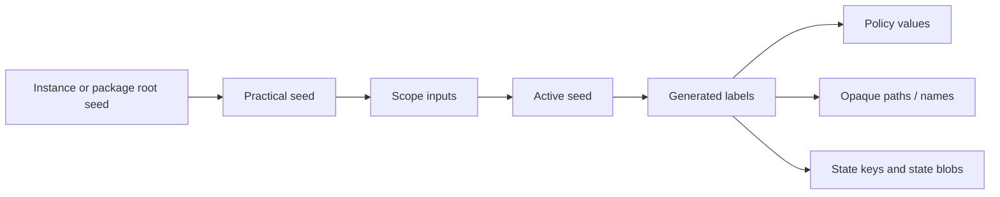

# Seeds

## Definition

A **seed** is a 16-byte secret input used to deterministically derive values, opaque storage identities, and state keys within a chosen scope. It is not itself a spoofed value and should not be exposed to target apps.

The seed model exists to make stability and rotation explicit. The same active seed, derivation label, and scope produce the same derived bytes; changing one of those inputs produces a separate result. Persisted state can preserve values that need a lifecycle beyond direct derivation.

## Seed layers

| Layer | Meaning | Typical origin | Purpose |
| --- | --- | --- | --- |
| Build instance seed | UUID supplied by the build selection. | `config/build.default.json` or another selection file. | Reproducible build input for local/dylib mode. |
| Package root seed | Persisted random seed in package mode. | Created once by `LHSeedProvider` when absent. | Stable package-level root without embedding a personal seed in source. |
| Practical seed | Effective parent seed before scoping. | Custom manual-group seed, instance seed, or package root seed. | Unifies package and standalone modes. |
| Active seed | Seed used by policy resolvers. | Deterministic scoped derivation or app-install derivation. | Produces policy values and opaque names for the current context. |
| State-derived value | Persisted or generated value associated with active seed and scope. | `LHStateProviderLoadOrCreate`. | Preserves a value that needs stateful lifetime. |

## Why seeds rather than literal values

Literal replacement values are difficult to rotate, easy to share accidentally, and can reveal a custom build. Seeds allow the project to derive outputs without storing every output in the binary. They also let a reset or scope change rotate a family of dependent values together.

A seed does not automatically make an output privacy-preserving. A resolver still needs a plausible value shape, a cohort/profile decision, and cross-surface coherence. Seeded uniqueness used without a shared-surface policy can still be fingerprintable.

## Derivation inputs

The core derivation function uses:

```text
active seed + generated derivation label + scope mode + scope identifier [+ optional context]
```

The current implementation uses HMAC-SHA256/HKDF-style expansion in `LHSeed.c`. The generator emits derivation labels into generated C data so labels are stable, distinct, and not scattered as ad hoc runtime strings.



## Rotation events

A derived value may rotate when:

- the configured build/instance seed changes;
- package root state is reset;
- a per-app-install marker changes because an app is reinstalled or reset;
- scope mode or scope identifier changes;
- a manual linked-group custom seed changes;
- a state schema change deliberately invalidates old state.

The expected rotation behavior belongs in each mitigation’s documentation. Rotation that is invisible in source but surprising to a user or app is a defect in the model.

## Seed handling constraints

- Seeds are configuration/state material, not telemetry.
- A UUID in `build.default.json` is a development selection input, not a production secret distribution mechanism.
- Hook modules do not parse, persist, or generate seed material directly.
- Generated labels and opaque names are domain-separated; a label must not be reused for unrelated values.
- Persisted seed material and derived state are privacy-sensitive and need package lifecycle review.
