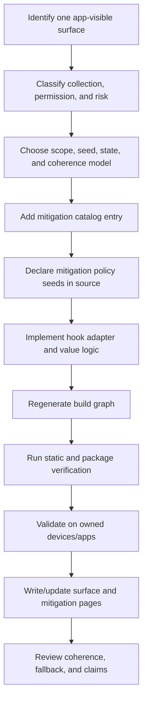

# Adding And Documenting A Mitigation

A mitigation is a bounded change to a specific app-visible surface. It comprises research, a catalog entry, a thin hook adapter, mitigation-owned value/state logic, generated registry participation, tests, and a detailed mitigation page. A hook alone is not a complete mitigation.

## Lifecycle



## 1. Define The Surface Precisely

Start with the observed API family, not a broad label such as "device identity." Record:

- exact classes, selectors, C symbols, resource keys, properties, or JavaScript interfaces;
- which values are passive, active, permissioned, hardware-bound, or unavailable by platform version;
- the original return shape, error behavior, and size-query behavior;
- adjacent APIs that can cross-check the same claim;
- permission, entitlement, and user-visible behavior;
- compatibility and detection risks.

A surface page records research. It does not imply implementation.

## 2. Choose The Smallest Safe Model

Answer before writing the hook:

- Is the safest behavior normalization, scoped derivation, persisted state, quantization, deliberate no-op, or pass-through?
- Which scope mode is appropriate: install, app, vendor, or manual linked group?
- Does the value need persisted state, or can it be derived deterministically?
- Which existing mitigation state/value helper must agree with it?
- What must happen when storage, seed derivation, the original symbol, or the target selector is unavailable?

Coherence is a mitigation-development responsibility, not a central profile feature. If two values must agree, make the involved mitigations use the same documented policy seed identifier and the same documented computation. Do not introduce a global coherence profile, cohort profile, or shared mitigation-owned state module.

## 3. Add Declarative Metadata

Add a mitigation entry in `config/mitigations.json` with:

- stable string `id`;
- source list;
- required frameworks, weak frameworks, and libraries;
- conflicts and platform requirements;
- `optionDoc` path under `docs/mitigations/`.

Do not add centralized value fields or source-language metadata. Do not create or restore a centralized value catalog.

Add the mitigation ID to `config/build.default.json` only when it should be compiled in the default profile. The default selection is not a dumping ground for unvalidated modules.

## 4. Declare Policy Seeds In The Mitigation

Use `LH_POLICY_SEED(identifier)` in selected source:

```c
LH_POLICY_SEED(volume_creation_date)
```

The generator hashes the build seed and identifier at compile time and emits generated policy seed bytes. The identifier should not appear in the built artifact.

Rules:

- pass both the active/practical seed and policy seed to mitigationkit helpers;
- use a distinct policy seed for each semantic identifier or random stream;
- reuse the same identifier only when two mitigations intentionally need the same policy seed;
- list every policy seed identifier and meaning in the mitigation page;
- treat a policy seed identifier change as a compatibility change because derived values rotate.

## 5. Use The Mitigationkit Helpers

Prefer helpers in `LHMitigationValues.h` over ad hoc derivation:

| Helper | Use |
| --- | --- |
| `LHMitigationDeriveBytes` | Raw deterministic bytes with optional context. |
| `LHMitigationDeriveU64` | Numeric stream input. |
| `LHMitigationDeriveBoundedU64` | Bounded numeric choice. |
| `LHMitigationDeriveUUIDString` | Stable UUID strings. |
| `LHMitigationDeriveASCIIString` | Stable opaque strings from an alphabet. |
| `LHMitigationDeriveTimeIntervalBetween` | Timestamp inside an interval. |
| `LHMitigationStateKeyFromPolicySeed` | State key labels from policy seeds. |
| `LHMitigationCopyStableTimeIntervalBetween` | Persisted timestamp inside caller-provided bounds. |
| `LHMitigationCopyStablePastTime` | Persisted timestamp within a relative age window before now. |

Every helper takes the active/practical seed and policy seed as minimum derivation inputs. Add a new helper to `src/mitigationkit/` only when it removes repeated value-shaping code from multiple mitigations or clarifies a tricky invariant.

## 6. Implement A Thin Hook Adapter

The hook should:

1. identify only the supported query shape;
2. derive or load the documented value through mitigationkit/runtime helpers;
3. adapt the value to the original API shape;
4. preserve normal errors, output sizing, and unrelated request behavior;
5. pass through on derivation, parsing, coherence, installation, or availability failure.

Use `LHHookBackend` for the hook mechanism: Objective-C message replacement for a selector, function patching for a direct function, and imported-symbol rebinding where callers can bypass a public wrapper. Keep original implementation pointers and never assume an original is always available.

## 7. Generate, Build, And Validate

```sh
make audit
make package
```

Add or update focused verifier coverage when the change touches seed derivation, package policy, state lifetime, or generated output.

## 8. Document The Implemented Behavior

Create or update a page in `docs/mitigations/`. Use this layout:

1. metadata: option ID, mitigation ID, status, surface, affected APIs, default behavior, permissions;
2. original API behavior and fingerprinting relevance;
3. exact hook coverage and untouched adjacent APIs;
4. policy seeds, derivation helpers, state owner, scope, lifetime, and dependencies;
5. impact, compatibility risk, and detection risk;
6. validation evidence and expected observations;
7. rollback and pass-through behavior.

Update the related surface page, root mitigation table when the selected set changes, status page, catalog reference, validation reference, and `AGENTS.md` source map.

## Review Stop Conditions

The mitigation is not ready to merge when any of these remain unclear:

- an adjacent API can trivially contradict the new value and no boundary is documented;
- the hook creates a value on error rather than passing through;
- state or scope lifetime is not specified;
- the catalog and detailed page disagree;
- a policy seed is undocumented or reused accidentally;
- a user-facing toggle changes more than its documented surface;
- validation claims are broader than the observed evidence;
- a literal project marker is added to target-process behavior.
