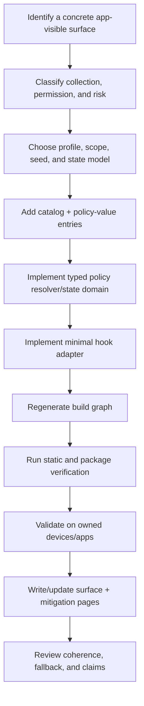

# Adding and documenting a mitigation

A mitigation is a bounded change to a specific app-visible surface. It comprises research, a catalog entry, policy value(s), a thin hook adapter, a resolver/state model, generated registry participation, tests, and a detailed mitigation page. A hook alone is not a complete mitigation.

## Lifecycle



## 1. Define the surface precisely

Start with the observed API family, not a broad label such as “device identity.” Record:

- exact classes, selectors, C symbols, resource keys, properties, or JavaScript interfaces;
- which values are passive, active, permissioned, hardware/cohort-bound, or unavailable by platform version;
- the original return shape, error behavior, and size-query behavior;
- adjacent APIs that can cross-check the same claim;
- permission, entitlement, and user-visible behavior;
- compatibility and detection risks.

A detailed page belongs in `docs/surfaces/` after the planned rename. The surface page records research; it does not imply implementation.

## 2. Choose the smallest safe policy model

Answer before writing the hook:

- Is the safest behavior normalization, a shared cohort value, scoped derivation, quantization, a deliberate no-op, or pass-through?
- Which scope mode is appropriate: per app install, per app, vendor group, or manual linked group?
- Does the value need persisted state, or can it be derived deterministically?
- Which existing state domain or policy value must agree with it?
- What must happen when storage, policy lookup, the original symbol, or the target selector is unavailable?

Use an existing state domain when it owns the required invariant. The temporal state domain, for example, owns ordering between volume creation and boot time. Do not create a second timestamp generator for an adjacent API.

## 3. Add declarative metadata

Add a mitigation entry in `config/mitigations.json` with, as applicable:

- stable string `id`;
- source list;
- policy-value IDs;
- language;
- status;
- required frameworks, weak frameworks, libraries;
- conflicts and platform requirements;
- `optionDoc` path under `docs/mitigations/`.

Add each policy value to `config/policy-values.json` with:

- a stable value `id`;
- typed `kind`;
- resolver symbol;
- resolver source list.

Add the mitigation ID to the default selection file only when it should be compiled in that profile. The default selection is not a dumping ground for unvalidated modules.

## 4. Implement the resolver and state domain

A policy resolver has ownership of value construction. It receives a typed request and returns a typed response through the policy engine. It may derive bytes from the active seed, load or create a versioned state blob, quantize a profile value, or combine those mechanisms.

Resolver rules:

- validate output shape before returning it;
- document state schema and lifetime;
- avoid returning a second unrelated fallback value when primary state fails.

## 5. Implement a thin hook adapter

The hook should:

1. identify only the supported query shape;
2. call the policy engine for the expected typed value;
3. adapt the value to the original API’s shape;
4. preserve normal errors, output sizing, and unrelated request behavior;
5. pass through on lookup, parsing, coherence, installation, or availability failure.

Pick the hook mechanism through `LHHookBackend`: Objective-C message replacement for a selector, function patching for a direct function, and imported-symbol rebinding where callers can bypass a public wrapper. Keep original implementation pointers and never assume an original is always available.

## 6. Generate, build, and validate

```sh
make audit
make package
```

## 7. Document the implemented behavior

Create a page in `docs/mitigations/` after the directory rename. Use the shared layout:

1. metadata — option ID, mitigation ID, status, surface, affected APIs, default behavior, permissions;
2. original API behavior and fingerprinting relevance;
3. exact hook coverage and untouched adjacent APIs;
4. policy value, derivation labels, state owner, scope, lifetime, and dependencies;
5. impact, compatibility risk, and detection risk;
6. validation evidence and expected observations;
7. rollback and pass-through behavior.

Update the related surface page, the root mitigation table when the selected set changes, the status page, catalog reference, validation reference, and `AGENTS.md` source map.

## Review stop conditions

The mitigation is not ready to merge when any of these remain unclear:

- an adjacent API can trivially contradict the new value and no boundary is documented;
- the hook creates a value on error rather than passing through;
- state or scope lifetime is not specified;
- the catalog and detailed page disagree;
- a user-facing toggle changes more than its documented surface;
- validation claims are broader than the observed evidence;
- a literal project marker is added to target-process behavior.
