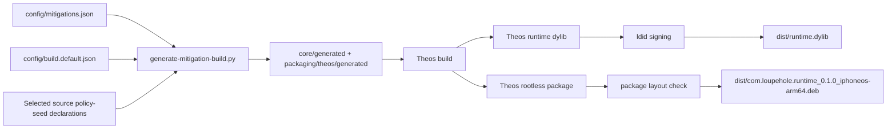

# Build environment and requirements

## Supported local environment

The canonical environment is macOS with Xcode, Theos, `ldid`, `dpkg-deb`, Python 3, and the command-line utilities used by project scripts. The project compiles an arm64 iOS dylib with a deployment target of iOS 15.0. The working baseline records Xcode 26+; the intended runtime window is iOS 15–26 and requires testing on actual supported devices.

| Dependency | Role |
| --- | --- |
| macOS + Xcode | Apple SDK, Clang toolchain, headers, and signing-related tooling. |
| Theos | Builds the injected dylib, rootless package, and preference bundle. |
| arm64 iOS SDK/toolchain | Required by the Theos target `iphone:clang:latest:15.0`. |
| `ldid` | Signs the standalone dylib before it is copied to `dist/`. |
| `dpkg-deb` | Creates the rootless Debian package. |
| Python 3 | Runs `scripts/build/generate-mitigation-build.py`. |
| shell / Mach-O tooling | Supports static verification and package layout checks. |

The root Makefile resolves `THEOS` from `THEOS_HOME` when present, otherwise from `~/theos`.

## Build graph



## Commands

```sh
# Default release dylib: generate → build → sign → dist/runtime.dylib
make

# Default release dylib plus static verification gates
make audit

# Rootless package: generate → build → package verification → dist/*.deb
make package

# Debug-oriented Theos configuration
CONFIG=debug make audit

# Select a different mitigation profile
BUILD_SELECTION=config/build.default.json make audit

# Clean generated package/build artifacts and dist outputs
make clean
```

## Artifacts

| Artifact | Path | Notes |
| --- | --- | --- |
| Standalone dylib | `dist/runtime.dylib` | Signed result of the selected build. |
| Debian package | `dist/com.loupehole.runtime_0.1.0_iphoneos-arm64.deb` | Rootless package generated from the same runtime selection. |
| Intermediate dylib | `packaging/theos/.theos/obj/<generated-loader-basename>.dylib` | Loader basename is generated; it is not a fixed runtime identity. |
| Theos package | `packaging/theos/packages/<package>_<version>_<arch>.deb` | Copied after package verification. |

## Verification gates

`make audit` includes:

- seed derivation checks;
- seed-provider checks;
- state-provider checks;
- mitigation-value checks;
- Mach-O summary;
- string scan;
- exported-symbol scan;
- Swift runtime absence check;
- debug-log absence check.

The checks are guardrails, not a complete assurance case. Real-device observation, target-app regression tests, package lifecycle checks, and cross-surface coherence tests remain required for mitigation changes.

## Build cleanliness

Generated files are inputs to Theos but outputs of the generator. They must not be edited manually. A build failure caused by catalog inconsistency is a configuration defect, not an invitation to patch generated C files. Build variants should change declarative selection/catalog inputs and rerun generation.
