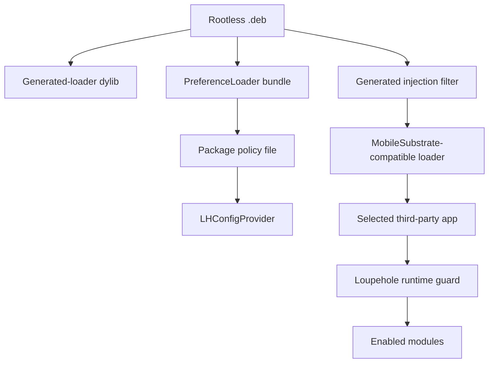

# Package architecture

## Package role

The rootless `.deb` packages the same selected runtime that can also be copied as an injectable dylib. Package mode adds a MobileSubstrate-compatible installation path, a PreferenceLoader Settings bundle, package-level policy storage, and generated filter management. It does not create a separate mitigation implementation.

The current package metadata identifies `com.loupehole.runtime`, targets `iphoneos-arm64`, and declares `mobilesubstrate` plus `preferenceloader` as dependencies.

The Theos project lives under `src/packaging/theos/` because it is source-adjacent build glue, not an end-user artifact directory. The root `make` target uses that same Theos project to build the standalone dylib, and `make package` uses it to assemble the rootless deb. Deb-only behavior is limited to package metadata, generated package layout, maintainer scripts, and PreferenceLoader installation.

## Package areas

| Area | Purpose |
| --- | --- |
| `src/packaging/theos/Makefile` | Defines the arm64 Theos build for the standalone dylib, rootless package, generated inputs, Foundation linkage, and preference bundle. |
| `src/packaging/theos/control` | Debian package metadata and runtime dependencies. |
| `src/packaging/theos/Filter.plist` | Source template for the injection filter. The installed filter uses the generated loader basename. |
| `src/ui/preferences/` | Preference store, controllers, Settings resources, and PreferenceLoader entry plist. |
| `src/packaging/theos/generated/` | Generated package-specific build and preference metadata. |
| `src/scripts/verify/package-layout-check.sh` | Verifies expected package layout after package build. |

## Injection and runtime guards

The source filter starts with no global bundle allowlist. Package preferences update the filter from policy:

- With default policy off, the filter contains explicitly enabled bundle IDs.
- With default policy on, the filter uses a UIKit app-class filter rather than an installed-app cache.
- A per-bundle disabled row remains effective even where the filter broadly reaches UIKit app processes, because the runtime guard exits as a no-op.

The filter is only the first gate. The runtime additionally excludes system bundle IDs, non-app processes, and extensions before resolving seeds or installing hooks.

## Preference and policy model

The packaged preference bundle is responsible for user-facing default policy, per-bundle policy, scope mode, custom seed support where applicable, selected module identifiers, debug/reset controls, and filter recomputation. The injected runtime reads a compact package policy representation through `LHConfigProvider`; it should not depend on UI classes or introduce Settings-specific names into target-process behavior.

A policy row contains enough information to decide:

- whether protection is enabled;
- which scope mode applies;
- whether module filtering is active and which generated module IDs are enabled;
- whether a custom seed applies.

The default row establishes baseline behavior; a matching bundle row replaces that effective policy.

## Package lifecycle requirements

A package change must remain safe across clean install, upgrade, disable, and uninstall. The package may own its dylib, generated filter, preference bundle, policy, state, and caches. It must not delete target-app data merely because the runtime has been configured for that app.

A feature that changes state-file formats, generated loader names, filter format, or package path derivation needs an explicit upgrade and rollback review. Package-specific state is privacy-sensitive: its stability determines how long derived values persist.

## Standalone dylib versus package mode

The standalone dylib uses the same selected sources and policy engine, but builds with the local state provider by default and always embeds the configured build seed as its practical seed. Package builds set `LH_STATE_PROVIDER_KIND=LHStateProviderKindPackage` and `LH_EMBED_BUILD_SEED=0` for the injected runtime dylib; the raw selection build seed is not present in that dylib. The deb can still include the build seed in the PreferenceLoader bundle when `LH_PREFERENCES_EMBED_BUILD_SEED=1`, so the debug pane can show the build metadata without changing runtime seed behavior.

Standalone dylib scope is selected at compile time with `LH_DEFAULT_SCOPE_MODE`, defaulting to per-app-install. Package scope is selected through runtime policy in Settings, with the compile-time scope serving only as a fallback before policy is applied. The distinction matters for policy defaults, root seed storage, package paths, Settings integration, and test assumptions; it must remain visible in documentation and validation.
