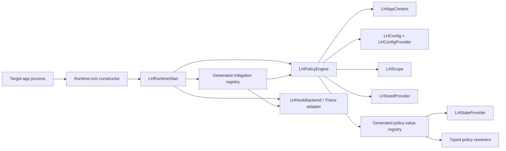

# Runtime architecture

## Overview

Loupehole is a small injected runtime centered on a policy engine. Hook modules are adapters: they recognize an API query, request a typed policy value, translate it into the API’s return shape, and pass through when a safe value is unavailable. They do not independently invent fingerprints, generate literal fake values, or own broad configuration logic.

## Startup sequence

1. `packages/tweak/sources/Runtime.mm` has a constructor that calls `LHRuntimeStart()`.
2. `core/src/LHRuntime.m` makes startup idempotent, initializes one `LHPolicyEngine`, creates the Theos hook backend, and asks `LHModuleRegistryInstall` to install selected modules.
3. `LHPolicyEngineInit` loads default config, resolves the current app context and default profile, applies package runtime policy when applicable, exits early when policy is disabled, resolves scope, and resolves the active seed.
4. `LHModuleRegistryInstall` iterates the generated registry. Disabled module IDs are registered as no-ops; enabled modules receive the backend and policy engine.
5. A hook asks `LHPolicyEngineCopyValue` for a typed value. The generated policy-value registry dispatches to the resolver named by the catalog.

The startup path is intentionally narrow. No hook should require its own independent startup, configuration parser, or persistent identity scheme.

## Core source map

| File or area | Responsibility |
| --- | --- |
| `packages/tweak/sources/Runtime.mm` | Constructor entry point only. |
| `core/src/LHRuntime.m` | Once-only runtime initialization, engine creation, and registry installation. |
| `core/src/LHPolicyEngine.c` | Central policy lifecycle, module enablement, seed derivation access, state access, and typed value dispatch. |
| `core/src/LHAppContext.m` | Current bundle/application context, targetability decisions, and scope input discovery. |
| `core/src/LHConfig.c` | Default runtime configuration and module-filter semantics. |
| `core/src/LHConfigProvider.m` | Package-mode runtime policy parsing and default/per-bundle override application. |
| `core/src/LHScope.c` | Scope representation and scope-mode constructors. |
| `core/src/LHSeed.c` | UUID parsing, HMAC-SHA256/HKDF-style expansion, contextual derivation, and opaque-name formatting. |
| `core/src/LHSeedProvider.m` | Root/practical/active seed selection, app-install markers, and package/local persistence behavior. |
| `core/src/LHStateProvider.m` | Load-or-create state blobs keyed by derivation label and schema version. |
| `core/src/LHProfile.c` | Compiled cohort-profile boundary. |
| `core/src/LHValueQuantizer.c` | Shared value-shaping utilities when a resolver needs a constrained distribution. |
| `core/src/LHHookBackend.c` | Backend-neutral wrapper functions. |
| `core/src/LHHookBackendTheos.c` | Theos / MobileSubstrate-compatible hook implementation. |
| `core/src/LHModuleRegistry.c` | Iteration over generated mitigation descriptors and no-op registration. |
| `core/generated/` | Generated configuration, derivation labels, mitigation registry, and policy-value registry. Never hand-edit. |

## Generated registries

Two generated registries make the selected build explicit:

- **Mitigation registry:** maps generated numeric module IDs to installer functions.
- **Policy-value registry:** maps value IDs and expected payload kinds to resolver functions.

A mitigation is present only when its catalog entry is selected during generation. Runtime preferences can disable a compiled module, but cannot dynamically load an uncompiled source tree.

## Hook backend boundary

`LHHookBackend` exposes three hook shapes: function patching, imported-symbol rebinding, and Objective-C message replacement. A module uses the smallest shape appropriate to the observed call path. The backend records original implementations so a replacement can preserve pass-through behavior.

The boot-time module demonstrates why this boundary exists: its public behavior may be reached through multiple C symbols and Objective-C Foundation APIs. The module uses a common policy value rather than making each adapter synthesize a timeline.

## State and lifecycle boundary

A resolver can ask the engine to load or create a typed state blob. State is separated from the hook because hook execution can be frequent, reentrant, or failure-prone. A state key contains a derivation label and schema version; changing either is a compatibility decision that needs a migration/reset story.

The runtime has three state-provider modes:

- **Embedded:** values are derived without package-state assumptions.
- **Local:** state is local to the injected process context.
- **Package:** rootless package paths and package policy are available.

Package mode begins disabled by default until policy enables a selected app. It also rejects non-targetable third-party application contexts before seed or hook setup.
