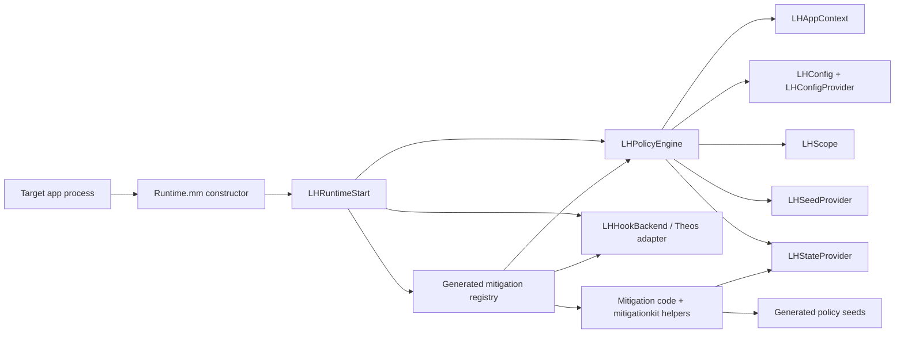

# Runtime Architecture

## Overview

Loupehole is a small injected runtime centered on module installation, scope selection, seed resolution, and state access. Hook modules are adapters: they recognize an API query, derive or load a documented mitigation-owned value, translate it into the API return shape, and pass through when a safe value is unavailable.

There is no centralized value registry. Mitigation-owned policy seeds are declared in selected source files and compiled into generated bytes.

## Startup Sequence

1. `src/runtime/entry/Runtime.mm` has a constructor that calls `LHRuntimeStart()`.
2. `src/runtime/engine/LHRuntime.m` makes startup idempotent, initializes one `LHPolicyEngine`, creates the Theos hook backend, and asks `LHModuleRegistryInstall` to install selected modules.
3. `LHPolicyEngineInit` loads default config, resolves the current app context, applies package runtime policy when applicable, exits early when policy is disabled, resolves scope, and resolves the active seed.
4. `LHModuleRegistryInstall` iterates the generated mitigation registry. Disabled module IDs are registered as no-ops; enabled modules receive the backend and policy engine.
5. A hook derives or loads its documented value using `policy->config.buildSeed`, `policy->appContext.scope`, generated policy seeds, and any needed state helper.

The startup path is intentionally narrow. No hook should require its own independent startup, configuration parser, or persistent identity scheme.

## Source Map

| File or area | Responsibility |
| --- | --- |
| `src/runtime/entry/Runtime.mm` | Constructor entry point only. |
| `src/runtime/engine/LHRuntime.m` | Once-only runtime initialization, engine creation, and registry installation. |
| `src/runtime/engine/LHPolicyEngine.c` | Central policy lifecycle, module enablement, seed derivation access, and state access. |
| `src/runtime/context/LHAppContext.m` | Current bundle/application context, targetability decisions, and scope input discovery. |
| `src/runtime/config/LHConfig.c` | Default runtime configuration and module-filter semantics. |
| `src/runtime/config/LHConfigProvider.m` | Package-mode runtime policy parsing and default/per-bundle override application. |
| `src/runtime/scope/LHScope.c` | Scope representation and scope-mode constructors. |
| `src/runtime/seeds/LHSeed.c` | UUID parsing, HMAC-SHA256/HKDF-style expansion, contextual derivation, and opaque-name formatting. |
| `src/runtime/seeds/LHSeedProvider.m` | Root/practical/active seed selection, app-install markers, and package/local persistence behavior. |
| `src/runtime/state/LHStateProvider.m` | Load-or-create state blobs keyed by derivation label and schema version. |
| `src/mitigationkit/LHMitigationValues.c` | Mitigation-facing value derivation helpers. |
| `src/mitigationkit/LHValueQuantizer.c` | Shared value-shaping utilities. |
| `src/runtime/hooks/LHHookBackend.c` | Backend-neutral wrapper functions. |
| `src/runtime/hooks/LHHookBackendTheos.c` | Theos/MobileSubstrate-compatible hook implementation. |
| `src/runtime/engine/LHModuleRegistry.c` | Iteration over generated mitigation descriptors and no-op registration. |
| `src/mitigations/` | Mitigation installers, hook adapters, and mitigation-owned value/state helpers. |
| `core/generated/` | Generated configuration, derivation labels, mitigation registry, and policy seeds. Never hand-edit. |

## Generated Outputs

Two generated runtime surfaces make the selected build explicit:

- **Mitigation registry:** maps generated numeric module IDs to installer functions.
- **Policy seeds:** maps selected `LH_POLICY_SEED` declarations to generated seed bytes.

A mitigation is present only when its catalog entry is selected during generation. Runtime preferences can disable a compiled module, but cannot dynamically load an uncompiled source tree.

## Hook Backend Boundary

`LHHookBackend` exposes three hook shapes: function patching, imported-symbol rebinding, and Objective-C message replacement. A module uses the smallest shape appropriate to the observed call path. The backend records original implementations so a replacement can preserve pass-through behavior.

The boot-time module demonstrates why this boundary exists: its public behavior may be reached through multiple C symbols and Objective-C Foundation APIs. Each adapter reads the same temporal helper rather than inventing an independent timeline.

## State And Lifecycle Boundary

A mitigation can ask the engine to load or create a state blob. State is separated from the hook because hook execution can be frequent, reentrant, or failure-prone. A state key contains generated bytes and a schema version; changing either is a compatibility decision that needs a migration/reset story.

The runtime has three state-provider modes:

- **Embedded:** values are derived without package-state assumptions.
- **Local:** state is local to the injected process context.
- **Package:** rootless package paths and package policy are available.

Package mode begins disabled by default until policy enables a selected app. It also rejects non-targetable third-party application contexts before seed or hook setup.
